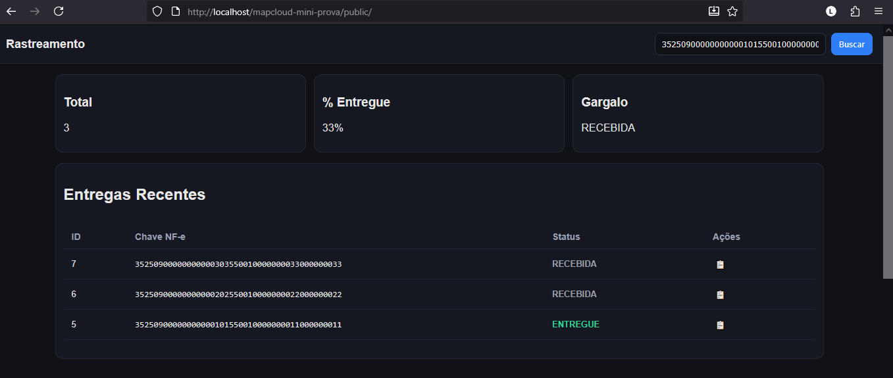

# MapCloud Mini‑Prova — Showcase

Este documento é um resumo rápido e executável do projeto, pensado para um reviewer/interviewador testar e entender o fluxo em poucos minutos.

> Use este arquivo para: demonstrar a aplicação localmente, rodar chamadas básicas via terminal e entender decisões principais do projeto.

---

## 1) Resumo rápido do fluxo

1.  Uma NF‑e (XML) é enviada ao endpoint `/backend/webhook_nfe_upload.php`.
2.  O backend cria/atualiza a entrada em `entregas` e registra um evento `NFE_RECEBIDA`.
3.  Eventos posteriores (webhooks de rastreamento) são enviados para `/backend/webhook_evento.php` como JSON (um objeto ou um array de objetos).
4.  O frontend (`public/index.html`) consulta `api_rastreamento.php` para exibir a timeline e o mapa. A listagem de NF‑es está em `api_entregas.php`.

---

## 2) Capturas / Demonstração visual

Inclua screenshots na pasta `docs/images/` (opcional). Sugestões de imagens para adicionar antes de apresentar:

- `dashboard.png` — Tela principal com KPI, timeline e mapa (ex.: a screenshot que você já possui).
- `upload.png` — Página de upload (`public/upload.html`) mostrando os formulários disponíveis.
- `listagem.png` — Tabela de entregas mostrando o botão de cópia e paginação.

Para inserir imagens neste arquivo, crie a pasta `docs/images` e coloque os arquivos; depois edite este arquivo com links relativos:

```markdown

```

---

## 3) Quick Start (Windows + XAMPP)

1.  Coloque o projeto em `C:\xampp\htdocs\mapcloud-mini-prova` (ou `d:\xampp\htdocs` como no meu ambiente).
2.  Crie o banco `mapcloud` e importe `backend/db.sql`.
3.  Ajuste credenciais em `backend/config.php` se necessário.
4.  Abra no browser:

- UI principal: `http://localhost/mapcloud-mini-prova/public/index.html`
- Página de testes: `http://localhost/mapcloud-mini-prova/public/upload.html`

---

## 4) Comandos de exemplo (PowerShell)

Observação: os exemplos abaixo funcionam com `curl.exe` (disponível no Windows 10+) ou com `Invoke-RestMethod`.

- Enviar NF-e (multipart/form-data) com `curl`:

```powershell
curl.exe -i -X POST "http://localhost/mapcloud-mini-prova/backend/webhook_nfe_upload.php" -F "xml=@sample_data/nfe_cenario1_entregue.xml;type=application/xml"
```

- Enviar NF-e como texto (raw body) com `Invoke-RestMethod`:

```powershell
$xml = Get-Content -Raw sample_data/nfe_cenario1_entregue.xml
Invoke-RestMethod -Uri "http://localhost/mapcloud-mini-prova/backend/webhook_nfe_upload.php" -Method Post -Body $xml -ContentType 'text/xml'
```

- Enviar eventos (array JSON) com `curl`:

```powershell
curl.exe -i -X POST "http://localhost/mapcloud-mini-prova/backend/webhook_evento.php" -H "Content-Type: application/json" -d @sample_data/eventos_cenario1_entregue.json
```

- Enviar eventos com `Invoke-RestMethod`:

```powershell
$json = Get-Content -Raw sample_data/eventos_cenario1_entregue.json
Invoke-RestMethod -Uri "http://localhost/mapcloud-mini-prova/backend/webhook_evento.php" -Method Post -Body $json -ContentType 'application/json'
```

- Consultar rastreamento (exemplo):

```powershell
curl.exe "http://localhost/mapcloud-mini-prova/backend/api_rastreamento.php?chave=35250900000000000101550010000000011000000011"
```

- Listar entregas (página 1):

```powershell
curl.exe "http://localhost/mapcloud-mini-prova/backend/api_entregas.php?page=1&limit=10"
```

- Consultar métricas / gargalo:

```powershell
curl.exe "http://localhost/mapcloud-mini-prova/backend/api_metricas_gargalo.php"
```

---

## 5) Teste rápido (fluxo mínimo em ~1 minuto)

1.  Envie uma NF‑e de exemplo (use o comando `curl` acima).
2.  Envie o JSON de eventos correspondente (arquivo `sample_data/eventos_*`) via `curl` ou formulário em `upload.html`.
3.  Abra `public/index.html`, cole a `chave` no campo de busca e pressione "Buscar". Verifique a timeline, mapa e a linha correspondente na tabela de entregas.

---

## 6) Contratos de API (resumo)

- `webhook_nfe_upload.php` (POST)
  - Entrada: XML (multipart/form-data campo `xml`, ou raw body, ou `xml_base64`).
  - Saída: `{"ok":true,"chave":"...","entrega_id":1}`

- `webhook_evento.php` (POST)
  - Entrada: JSON (objeto ou array). Campos recomendados por evento: `chave` (string), `status` (string), `lat`/`lng` (opc.), `observacao` (opc.), `data_hora` (opc.).
  - Saída: `{"ok":true,"processed_events":N,"last_chave":"..."}`

- `api_rastreamento.php?chave=...` (GET)
  - Saída: `{chave:"...", entrega:{...}, eventos:[...]}`

- `api_entregas.php?page=1&limit=10` (GET)
  - Saída: `{data:[...], page:1, total: N}`

---

## 7) Dicas para o entrevistador / pontos de atenção

- Implementado com foco em compatibilidade (PHP 5.x) e simplicidade — código procedural, sem dependências externas.
- Roteamento por arquivos PHP foi uma decisão prática para evitar problemas com `PATH_INFO` no ambiente XAMPP local.
- Geocodificação em ambiente de desenvolvimento é feita por um stub (`sample_data/geocode_stub.json`); produção exigiria integração com ViaCEP + um serviço de geocodificação.
- A lógica de prevenção de duplicidade usa checagem em código (`event_exists`) e um índice UNIQUE no banco, por redundância e segurança.

---

## 8) Recursos extras (opcional)

- `public/upload.html`: formulário útil para testes manuais (arquivo XML, texto, base64 e envio de eventos JSON).
- `sample_data/`: exemplos prontos (`nfe_*.xml`, `eventos_*.json`, `geocode_stub.json`).

---
